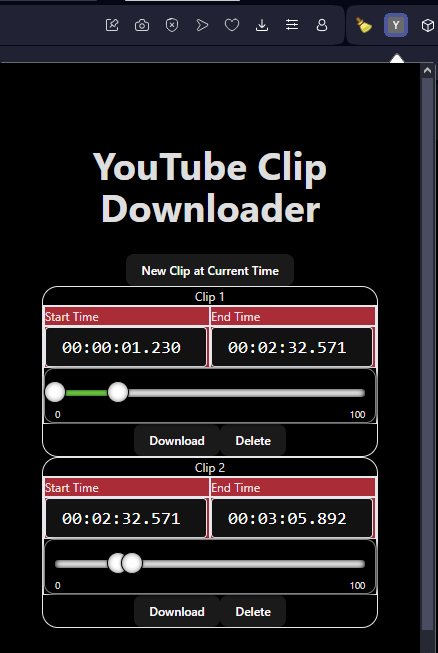

# Youtube Clip Downloader Extension:
This is an proof-of-concept clip downloader for  youtube videos. User can download  specific parts of video  using this
tool. User can store ranges of the video  to download later  as well. The clip selection is managed by 2 mechanism, first
is slider, and the second is the input box. 

* In input box, user either can enter manually or iterate  over the  video on  the basis  of  the  digit  currently  
selected  using  up  and down  keys.

* The  slider  is  quite self-explanatory.

* The video  frame  is  also  showed for  user to see  which frame  it will  start cutting the video.

The tool is not fully pipelined yet. Has shortcomings and spagetti code here and there and needs some cleanup. Future 
updates are going to be sure of that. 

## How to  Run:
* Download and install ffmpeg on your system.
* Download this package
* Go  to  your extensions page of  your browser
* Select the directory of  this package with "Load Unpackaged"
* npm install
* Run  native-host/app.py
* Done.

## Future Directions:
### React - Typescript -  Vite Frontend:
* Clean-up
* Optimize hooks
* Make the ui pretty
* Add Download progress
* Add Downloaded Section
### Python backend:
* Add Parallel Download
* Clean-up
* Send  Progress
* Build Server  with the frontend